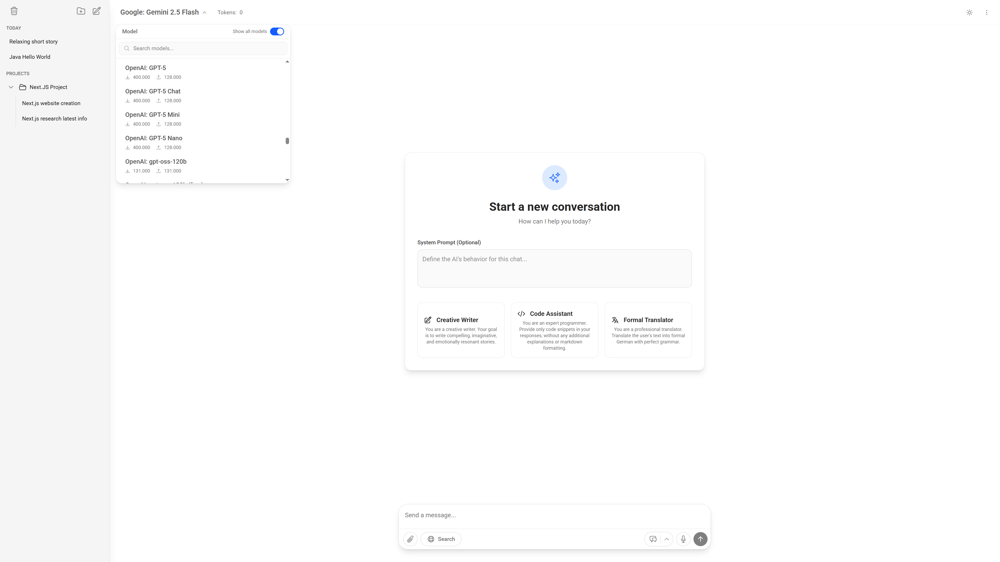

# QuantaGem: Advanced Multimodal Chat Interface

[](https://nextjs.org/) [](https://tailwindcss.com/) [](https://www.postgresql.org/) [](https://www.docker.com/)

QuantaGem is a feature-rich, open-source, self-hostable web interface designed for advanced interaction with various AI models. It provides a sophisticated, project-based chat experience with extensive multimodal capabilities, including real-time voice and screen sharing sessions.



## ✨ Key Features

*   **🗂️ Project-Based Organization**: Group your conversations and related files into distinct projects, each with its own customizable system prompt.
*   **🧠 Multi-Model Support (via OpenRouter.ai)**: Access a wide range of LLMs by connecting to the OpenRouter.ai API.
*   **🗣️ Live Conversational AI**: Engage in real-time, bidirectional conversations using Google's native audio models.
    *   **🎙️ Real-time Audio**: Speak and receive spoken responses from the AI.
    *   **📺 Screen Sharing**: Share your screen as a video feed for context in live sessions.
    *   **🔊 Text-to-Speech (TTS)**: Have any message read aloud with a choice of high-quality voices.
*   **🎤 High-Quality Speech-to-Text**: Integrated FastAPI service using `faster-whisper` for accurate voice dictation.
*   **🌐 Web Search Integration**: Enable models to access the internet for up-to-date information.
*   **📎 Multimodal Inputs**: Attach images, audio, PDFs, and source code files directly to your messages. URLs are automatically scraped for context.
*   **🔒 Secure & Private**: Self-host the entire stack with Docker. Full user authentication system with JWT sessions.
*   **💾 Persistent Storage**: Conversations and user data are securely stored in a PostgreSQL database. Files are managed with a dedicated MinIO S3-compatible object storage.
*   **✍️ Advanced Chat Controls**: Edit your messages, regenerate AI responses, duplicate entire conversations, and manage chat history with ease.
*   **🎨 Polished UI**: Modern, responsive interface built with Next.js and Tailwind CSS, featuring a robust dark mode.

## 🛠️ Tech Stack

*   **Framework**: Next.js (App Router) & React
*   **Styling**: Tailwind CSS
*   **Language**: TypeScript
*   **Database**: PostgreSQL
*   **File Storage**: MinIO (S3-compatible)
*   **Caching/Rate Limiting**: Redis
*   **Speech-to-Text Service**: FastAPI (Python) with `faster-whisper`
*   **Containerization**: Docker & Docker Compose

## 🚀 Getting Started

### Prerequisites

*   [Docker](https://docs.docker.com/get-docker/) & [Docker Compose](https://docs.docker.com/compose/install/)
*   An API key from a service compatible with the OpenAI API format, such as [OpenRouter.ai](https://openrouter.ai/) (for main chat models).
*   A Google AI API key (for Live Sessions and TTS). You can get one from [Google AI Studio](https://aistudio.google.com/).

### 1. Clone the Repository

```bash
git clone https://github.com/W4D-cmd/QuantaGem.git
cd QuantaGem
```

### 2. Environment Configuration

Create a local environment file by copying the template:

```bash
cp .env .env.local
```

Now, open `.env.local` and fill in the required values.

| Variable | Description |
| :--- | :--- |
| `OPENAI_API_KEY` | **Required.** Your API key for the chat model provider (e.g., OpenRouter.ai). |
| `OPENAI_API_BASE_URL` | **Required.** The base URL for the API. Defaults to OpenRouter. |
| `PAID_GOOGLE_API_KEY` | **Required.** Your Google AI API key for Live Sessions and TTS. |
| `JWT_SECRET` | **Required.** A long, random, secure string for signing session tokens. |

You can generate a secure `JWT_SECRET` with the following command:

```bash
node -e "console.log(require('crypto').randomBytes(32).toString('base64'))"
```

The database and MinIO credentials are pre-filled in the `.env` file and are used internally by the Docker services. You typically do not need to change them.

### 3. Run the Application

Start the entire application stack using Docker Compose:

```bash
docker compose up --build
```

This command will:
*   Build the Docker images for the Next.js app and the STT service.
*   Start all services: the main app, PostgreSQL, MinIO, Redis, and the STT service.
*   The first time you run this, it will download the STT model, which may take some time.

Once all services are running, you can access the application:
*   **Web Application**: [http://localhost:3000](http://localhost:3000)
*   **MinIO Console**: [http://localhost:9001](http://localhost:9001) (Use `MINIO_ROOT_USER` and `MINIO_ROOT_PASSWORD` from your `.env.local` to log in)

## ⚙️ Configuration

### Customizing the Speech-to-Text (STT) Model

The application uses the `medium` model from the Faster Whisper family by default. You can change this to balance performance and accuracy.

1.  Open the file `stt-service/main.py`.
2.  Locate the `model_size` variable at the top of the file.
3.  Replace the value (e.g., `"medium"`) with your desired model name.
4.  Rebuild the Docker containers for the change to take effect: `docker compose up --build`.

<details>
<summary><b>Available Faster Whisper Models</b></summary>

Larger models are more accurate but slower and require more resources.

*   `tiny`, `base`, `small`, `medium`, `large-v3` (multilingual)
*   `tiny.en`, `base.en`, `small.en`, `medium.en` (English-only)
*   `distil-small.en`, `distil-medium.en`, `distil-large-v3` (distilled)

</details>

## 🤝 Contributing

Contributions are welcome! Please follow these steps:

1.  Fork the repository.
2.  Create your feature branch (`git checkout -b feature/your-awesome-feature`).
3.  Commit your changes (`git commit -am 'Add some awesome feature'`).
4.  Push to the branch (`git push origin feature/your-awesome-feature`).
5.  Create a new Pull Request.

## 📄 License

This project is licensed under the MIT License. See the [LICENSE](LICENSE) file for details.
